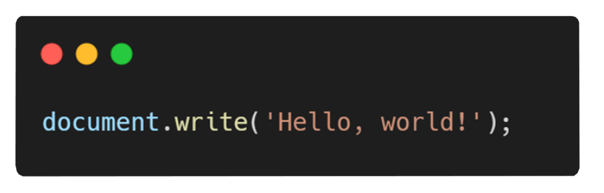

  

<h1 align="center">I'm Diego Franco 👋</h1>

<h3 align="center">Software Developer</h3>

  

- 🔭 I’m currently working on **Web Development**

- 🌱 I’m currently learning **React.js**

- 👨‍💻 All of my projects are available at [https://github.com/DGusFr](https://github.com/DGusFr)

- 💬 Ask me about **React.js, Next.js and Angular.js**

- 📫 How to reach me **diego.u.franco@gmail.com**

<h3 align="left">Connect with me:</h3>
  

   
  

<h3>Front-end</h3>

   
   
    
  
  
  

     
      

  

 

