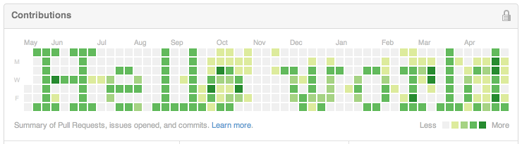

<div align="center">
  
</div>

<br>

<h1 align="center">Hi, I'm Diego Franco 👋</h1>

<h3 align="center">
  Back-End Developer | Computer Engineering Student | Python Enthusiast
</h3>

<p align="center">
  Passionate about building reliable back-end systems, learning software architecture,
  and solving real-world problems with clean and maintainable code.
</p>

<br>

<div align="center">
  <a href="https://github.com/dgusfr">
    
  </a>
  <a href="https://www.linkedin.com/in/YOUR_LINKEDIN_USERNAME/" target="_blank">
    
  </a>
  <a href="mailto:diegogustavo.fr@gmail.com">
    
  </a>
</div>

---

## 👨‍💻 About Me

I am a **Back-End Developer** based in **Jundiaí, São Paulo, Brazil**, currently studying **Computer Engineering** and continuously improving my skills in software development, system design, APIs, databases, cloud computing, and DevOps practices.

My professional focus is on building scalable, secure, and maintainable back-end solutions. I enjoy understanding how systems work behind the scenes, reading and improving legacy code, designing APIs, working with databases, and learning how different services communicate in real-world architectures.

- 💼 Currently working as a **Back-End Developer**
- 🎓 Studying **Computer Engineering**
- 🧠 Focused on improving my skills in **Python, APIs, databases, system design, Git, and DevOps**
- 🔍 Interested in **software architecture, clean code, cloud computing, observability, and distributed systems**
- 🚀 Always learning through practical projects, documentation, and real-world problem solving
- 🌎 Based in **Brazil**

---

## 🧭 Current Focus

- Improving my back-end development skills
- Deepening my understanding of legacy codebases
- Practicing Git workflows used in real development teams
- Building APIs with Python frameworks
- Studying system design and software architecture
- Learning more about Docker, cloud services, and CI/CD pipelines

---

## 🛠️ Technologies and Tools

### 💻 Programming Languages

<div align="center">
  
</div>

<br>

### 🚀 Frameworks and Libraries

<div align="center">
  
  &nbsp;&nbsp;&nbsp;
  
  &nbsp;&nbsp;&nbsp;
  
</div>

<br>

### 🗄️ Databases

<div align="center">
  
  &nbsp;&nbsp;&nbsp;
  
  &nbsp;&nbsp;&nbsp;
  
  &nbsp;&nbsp;&nbsp;
  
</div>

<br>

### ⚙️ DevOps, Tools and Version Control

<div align="center">
  
  &nbsp;&nbsp;&nbsp;
  
  &nbsp;&nbsp;&nbsp;
  
  &nbsp;&nbsp;&nbsp;
  
  &nbsp;&nbsp;&nbsp;
  
</div>

<br>

### ☁️ Cloud and Infrastructure

<div align="center">
  
  &nbsp;&nbsp;&nbsp;
  
</div>

---

## 📌 Back-End Skills

- API development and integration
- RESTful services
- Authentication and authorization concepts
- Database modeling and queries
- Git and GitHub workflows
- Debugging and troubleshooting
- Reading and understanding legacy code
- Writing clean, maintainable, and testable code
- Understanding service communication and business rules
- Continuous learning through documentation and hands-on practice

---

## 📚 Currently Learning

<div align="center">
  
  
  
  
</div>

---

## 📊 GitHub Stats

<div align="center">
  <a href="https://github.com/dgusfr">
    
    
  </a>
</div>

<br>

<div align="center">
  
</div>

---

## 🧩 What I Value as a Developer

```python
developer = {
    "name": "Diego Franco",
    "role": "Back-End Developer",
    "main_language": "Python",
    "values": [
        "clean code",
        "continuous learning",
        "problem solving",
        "collaboration",
        "ownership",
        "software quality"
    ],
    "currently_improving": [
        "system design",
        "legacy code reading",
        "Git workflows",
        "APIs",
        "DevOps practices"
    ]
}

🤝 Let's Connect
<div align="center"> <a href="mailto:diegogustavo.fr@gmail.com">  </a> <a href="https://www.linkedin.com/in/YOUR_LINKEDIN_USERNAME/" target="_blank">  </a> <a href="https://github.com/YOUR_GITHUB_USERNAME" target="_blank">  </a> </div>
<div align="center"> <p> <strong>Thanks for visiting my profile!</strong> </p> <p> Always learning, building, and improving as a Back-End Developer. </p> </div> ```

One important detail: your GitHub profile README only appears when the repository name is exactly the same as your GitHub username, and it must be public with a README.md file. The Alura article also explains this “special repository” behavior.
